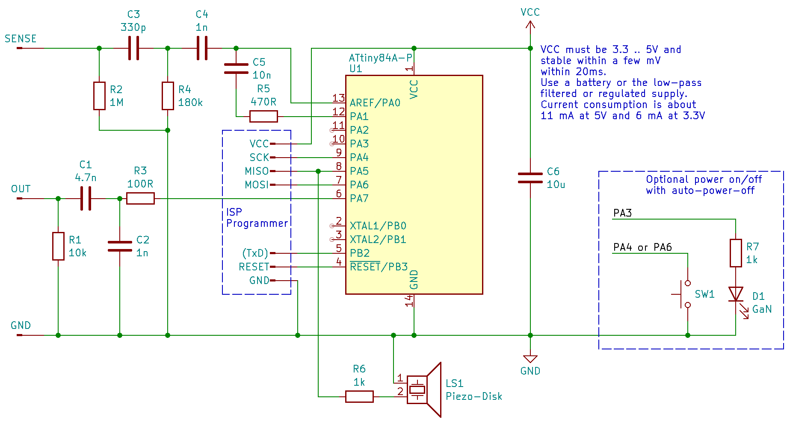
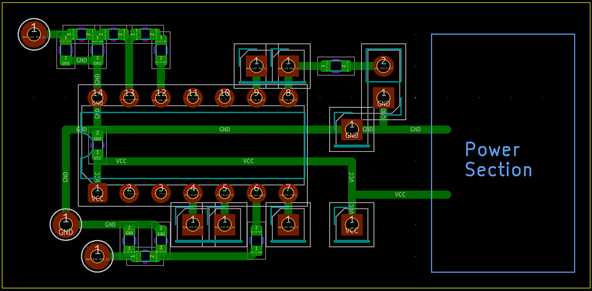
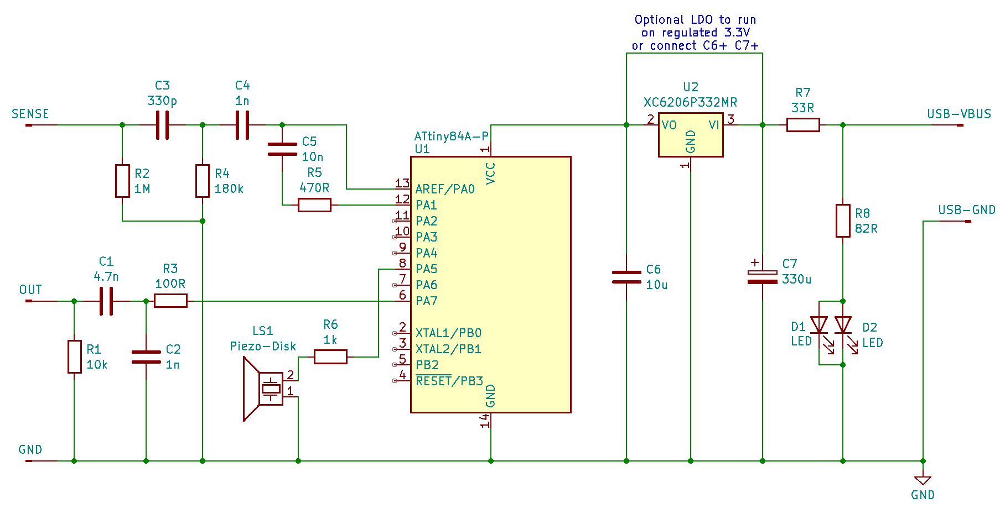
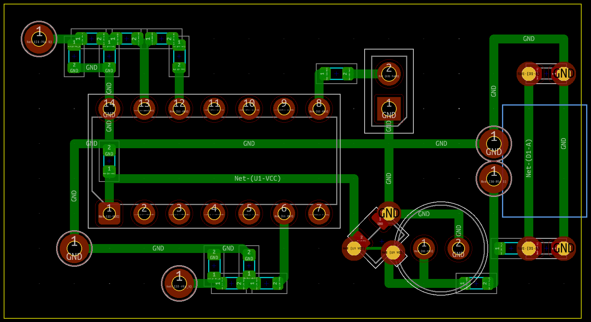
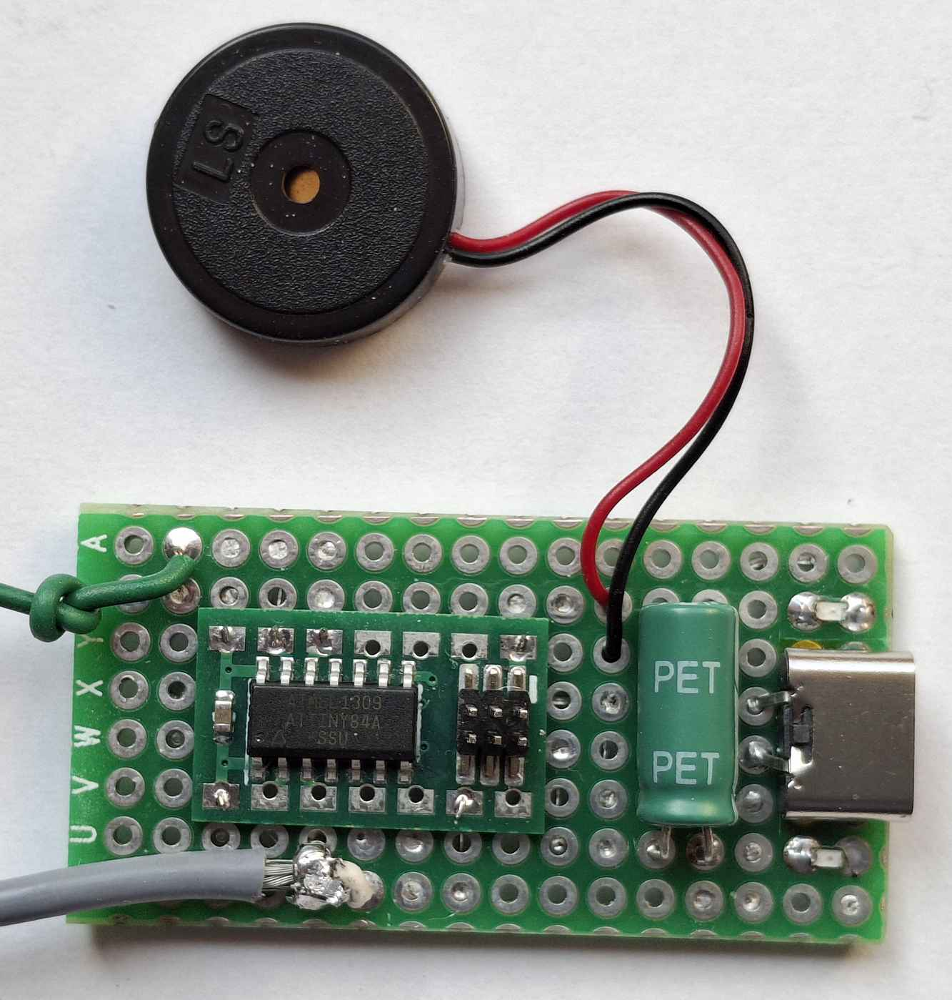
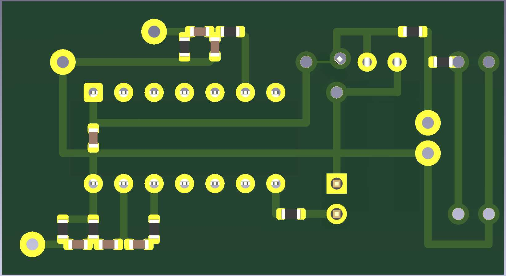
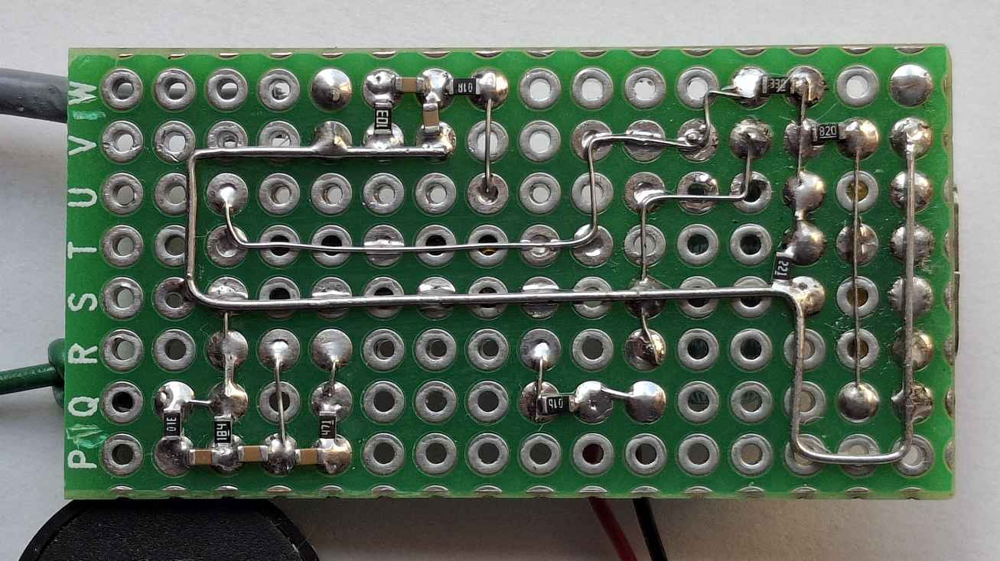
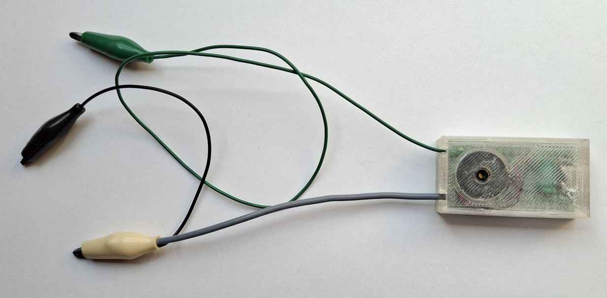

# Hardware build instructions

There are two sets of schematics and PCBs:

- [template](template) contains the files you can use as a start
  to build your own device. The schematics and layout does not contain
  the power section, so you can choose what is suitable for your
  needs.  
  \
  
- [my_build](my_build) contains the full schematics and layout of what I actually
  built for myself as a reference.  
  \
  \
  \
  \
  \
  

# Layout and cables

- Keep output components and connection close to the Pin 6 and away form
  sense input.
- Use a shielded cable for the output signal. The shield (connected to
  GND) should go as close to the output components and the external
  output clip as possible. The GND clip can be connected to either side
  of the shield of the output cable.
- Keep sense input components and connection close to the input pins.
- Use a unshielded cable for the sense input to keep the input capacity
  low.

# Powering

The power source is critical. Due to the measurement principle of the
device, VCC must be rather stable within a measurement cycle of 20ms.

The ideal power source is a battery. A 3.6V lithium battery (non
rechargeable or rechargeable) or 3 AAA cells (alkaline or NiMH)

When using external power, the source should not have much ripple and a
proper voltage regulation. Many cheap USB chargers fail in both
disciplines. Also the power source must not have any mains common-mode
signal. Use either a power-bank or a mains power supply that has an
earth referenced output.

The usual 2 pin (mains) chargers have a Y2 capacitor from the mains to
the GND of the output and therefore a common-mode 50/60Hz signal of up
to 300Vpp. This is not acceptable for the high impedance measurement of
the cable tester and might even damage it.

When using power-banks, practically all modern ones require a minimal
load to stay on. I tested my build (consumes 43 mA with the two LEDs)
with 4 different power-banks a the current was sufficient for two of them
to stay on but not for the other two.